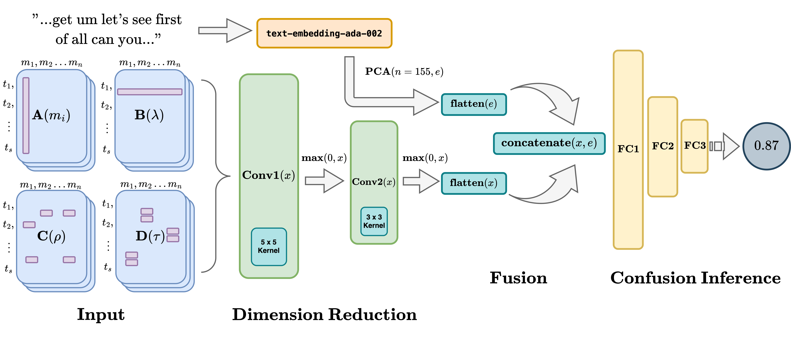

# multimodal-dropping-strats


Modality dropping strategies using 1D-CNN layer freezing, applied to [MULTICOLLAB dataset](https://aclanthology.org/2024.lrec-main.1023/) which can be cited below:

```bibtex
@inproceedings{peechatt-etal-2024-multicollab,
    title = "{MULTICOLLAB}: A Multimodal Corpus of Dialogues for Analyzing Collaboration and Frustration in Language",
    author = "Peechatt, Michael  and
      Alm, Cecilia Ovesdotter  and
      Bailey, Reynold",
    editor = "Calzolari, Nicoletta  and
      Kan, Min-Yen  and
      Hoste, Veronique  and
      Lenci, Alessandro  and
      Sakti, Sakriani  and
      Xue, Nianwen",
    booktitle = "Proceedings of the 2024 Joint International Conference on Computational Linguistics, Language Resources and Evaluation (LREC-COLING 2024)",
    month = may,
    year = "2024",
    address = "Torino, Italia",
    publisher = "ELRA and ICCL",
    url = "https://aclanthology.org/2024.lrec-main.1023",
    pages = "11713--11722",
    abstract = "This paper addresses an existing resource gap for studying complex emotional states when a speaker collaborates with a partner to solve a task. We present a novel dialogue resource {---} the MULTICOLLAB corpus {---} where two interlocutors, an instructor and builder, communicated through a Zoom call while sensors recorded eye gaze, facial action units, and galvanic skin response, with transcribed speech signals, resulting in a unique, heavily multimodal corpus. The builder received instructions from the instructor. Half of the builders were privately told to disobey the instructor{'}s directions. After the task, participants watched the Zoom recording and annotated their instances of frustration. In this study, we introduce this new corpus and perform computational experiments with time series transformers, using early fusion through time for sensor data and late fusion for speech transcripts. We then average predictions from both methods to recognize instructor frustration. Using sensor and speech data in a 4.5 second time window, we find that the fusion of both models yields 21{\%} improvement in classification accuracy (with a precision of 79{\%} and F1 of 63{\%}) over a comparison baseline, demonstrating that complex emotions can be recognized when rich multimodal data from transcribed spoken dialogue and biophysical sensor data are fused.",
}
```
